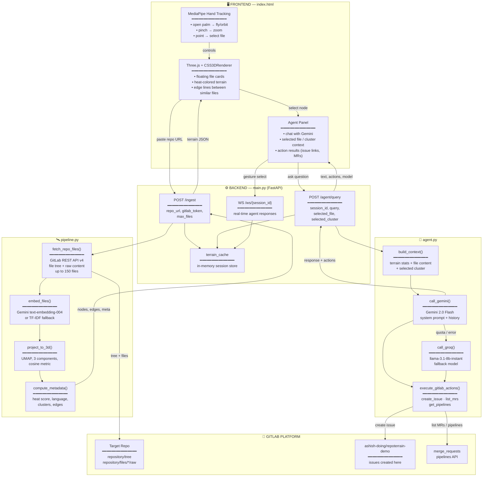
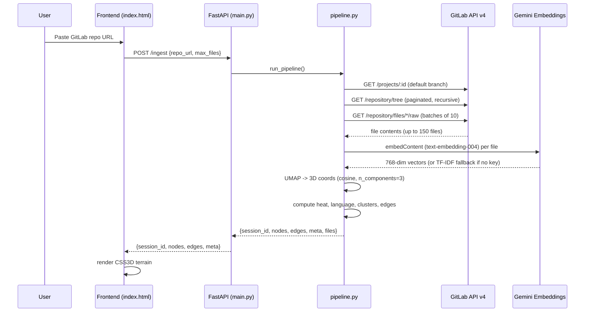
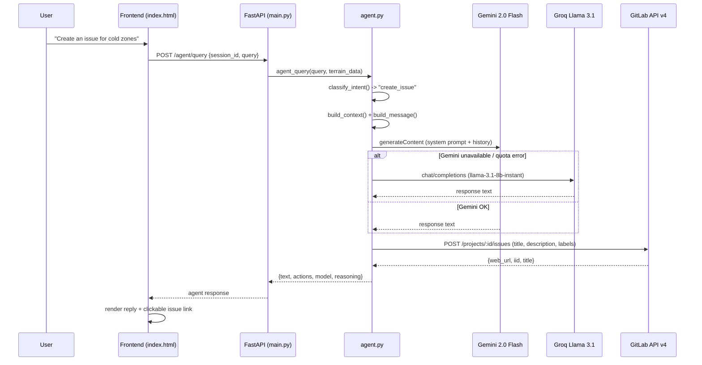
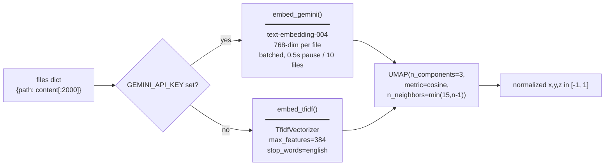
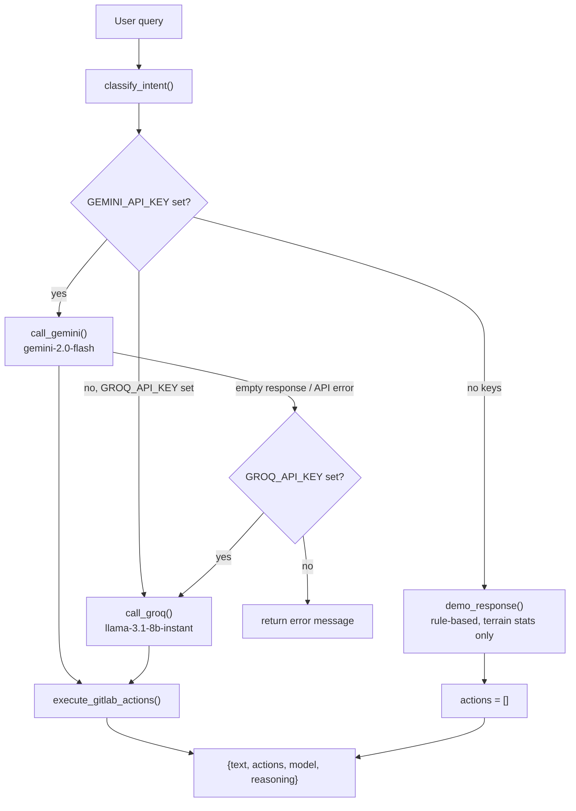

# RepoTerrain — Architecture

## Overview

RepoTerrain has two phases: an **ingest pipeline** that turns a GitLab repository into a 3D semantic terrain, and an **agent loop** that lets Gemini 2.0 Flash answer questions about that terrain and take real actions on GitLab via MCP-style REST calls.

---

## System Diagram



---

## Request Flow — Ingest



---

## Request Flow — Agent Query



---

## Component Map

| File | Responsibility |
|---|---|
| `backend/main.py` | FastAPI app — `/`, `/app`, `/health`, `/ingest`, `/agent/query`, `/ws/{session_id}`, `/terrain/{session_id}` |
| `backend/pipeline.py` | GitLab fetch -> embed -> UMAP -> heat/language/cluster/edge computation -> terrain JSON |
| `backend/agent.py` | Intent classification, context building, Gemini/Groq calls, GitLab MCP action execution |
| `backend/index.html` | Single-file frontend — Three.js terrain, MediaPipe hand tracking, agent chat panel |
| `backend/landing.html` | Product landing page served at `/` |
| `docs/index.html` | GitHub Pages mirror of the landing page |

---

## Embedding Strategy



If a Gemini embed call fails for a single file, `pipeline.py` substitutes a random 768-dim vector for that file rather than failing the whole batch — so one bad file never blocks terrain generation.

---

## Heat & Cluster Computation

`compute_metadata()` derives, per file:

- **`heat`** (0.05–1.0) — base 0.2, boosted for filenames matching core/entry patterns (`main`, `index`, `app`, `server`, `router`, `config`, `auth`, `core`, `client`, `engine`, ...), reduced for `test`, `spec`, `mock`, `readme`, `changelog`, etc., plus a contribution from file size and tree depth (shallower files run hotter).
- **`language`** — derived from file extension via a fixed extension map.
- **`size`** — `min(content_length / 5000, 1.0)`.

`compute_clusters()` groups files by parent directory name (falling back to language when a file is at the root), discarding clusters with fewer than 2 members.

`compute_edges()` connects each node to its 3 nearest neighbours in 3D space, capped at `max_dist = 0.35`, giving the terrain its semantic-connection lines.

---

## GitLab MCP Actions

The agent executes real GitLab operations via the REST API v4 — these are not simulated; issues created appear on the live repository.

```python
# Issue creation (simplified)
POST https://gitlab.com/api/v4/projects/{project_path}/issues
{
  "title": "...",
  "description": "🤖 Created by RepoTerrain AI Agent\n\n...",
  "labels": "repoterrain"  # or tech-debt/low-priority, needs-review/high-priority
}
# Returns: { "web_url": "https://gitlab.com/ashish-doing/repoterrain-demo/-/issues/N" }
```

| Intent (from `classify_intent`) | Action | Endpoint |
|---|---|---|
| `create_issue` | `gitlab_create_issue()` | `POST /projects/ashish-doing%2Frepoterrain-demo/issues` |
| `list_mrs` | `gitlab_list_mrs()` | `GET /merge_requests?state=opened&per_page=5` |
| `get_pipelines` | `gitlab_get_pipelines()` | `GET /projects/:id/pipelines?per_page=5` |

Issue titles are extracted from the agent's first non-bullet response line; labels are chosen from the query keywords (`cold`/`legacy` -> `tech-debt, low-priority`, `hot`/`complex` -> `needs-review, high-priority`, otherwise `repoterrain`).

---

## Agent Fallback Chain



Each session keeps its last 16 conversation turns (`history[-16:]`) so follow-up questions retain context across both Gemini and Groq calls.

---

## Environment Variables

| Variable | Used In | Effect if Missing |
|---|---|---|
| `GEMINI_API_KEY` | `pipeline.py` (embeddings), `agent.py` (chat) | Falls back to TF-IDF embeddings and Groq/demo agent |
| `GROQ_API_KEY` | `agent.py` | Agent falls back to rule-based `demo_response()` |
| `GITLAB_TOKEN` | `agent.py`, `pipeline.py` | GitLab MCP actions disabled; private repos inaccessible; public repos still ingestible |

---

## Deployment

Hosted on Railway via `nixpacks.toml`:

```toml
[phases.setup]
nixPkgs = ["python310", "gcc"]

[phases.install]
cmds = ["pip install -r backend/requirements.txt"]

[start]
cmd = "cd backend && uvicorn main:app --host 0.0.0.0 --port $PORT"
```

`landing.html` and `index.html` are served directly by FastAPI (`/` and `/app`) — no separate frontend build step. `deploy.sh` provides an alternative Cloud Run deployment path using Docker + `gcloud run deploy`.

Live URL: `https://repoterrain-production.up.railway.app`