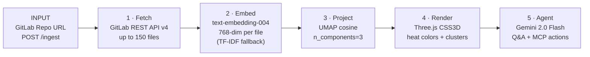

<div align="center">


<br/>

<p>
  
  
  
  
  
  
</p>

<br/>

<p><strong>Google Cloud Rapid Agent Hackathon — GitLab Track — June 2026</strong></p>

> Transform any GitLab repository into a navigable 3D semantic terrain. Files float as cards positioned by Google AI similarity. A Gemini 2.0 Flash agent analyzes the codebase and creates real GitLab issues via a self-hosted MCP server — all navigable with bare hands.

<p><a href="https://repoterrain.onrender.com/app"></a> <a href="https://repoterrain.onrender.com/"></a> <a href="https://github.com/ashish-doing/repoterrain/blob/main/ARCHITECTURE.md"></a> <a href="https://youtu.be/gNbQTBpotFM"></a></p>

</div>

---

## Demo Video

[](https://youtu.be/gNbQTBpotFM)

▶️ [Watch the 4-minute demo on YouTube](https://youtu.be/gNbQTBpotFM)

---

## The Problem

Every developer has stared at a repo they've never seen before and had no idea where to start. File trees tell you nothing about relationships, activity, or importance — onboarding takes days, and tech debt hides invisibly in cold corners of the project.

## What It Does

Paste any public GitLab repository URL. In ~15 seconds:

- **Up to 150 files** fetched via GitLab REST API v4, embedded with Google AI `text-embedding-004`, projected into 3D space via UMAP
- **Semantic clusters** emerge — files grouped by directory proximity, not just raw folder structure
- **Activity heat map** scores each file 0–1 from filename role, size, and tree depth — a proxy for activity since GitLab API doesn't expose commit frequency without authentication. Red = core/active, blue = legacy/docs
- **Gemini 2.0 Flash agent** answers questions with real file content and live terrain stats as context; falls back to Groq LLaMA 3.1 if quota exceeded
- **GitLab MCP actions** create real issues, list open MRs, and fetch pipeline status — via a self-hosted `zereight/gitlab-mcp` gateway (Streamable HTTP, MCP-Protocol-Version 2025-03-26), with REST API v4 as transparent fallback
- **MediaPipe hand tracking** — open palm to fly, pinch to zoom, point to select files, fist to rotate

```
Tested on gitlab-org/gitlab-runner → 149 files · multiple semantic clusters · ~15s end-to-end
```

---

## Screenshots

| | |
|---|---|
|  |  |
| **Landing page** — paste any GitLab repo URL | **3D terrain + Gemini agent** — real issue created live |
|  |  |
| **Activity heat map** — hot files, clusters, cold zones | **Hand tracking** — navigate with gestures, no mouse |


**Live GitLab issue** — created by the agent on `ashish-doing/repoterrain-demo`, not simulated

---

## Agent in Action

| Query | What Happens |
|---|---|
| `"What's the most complex module?"` | Gemini reads terrain stats + real file content → structured analysis citing actual filenames |
| `"Create an issue for cold zones"` | Real GitLab issue created on `ashish-doing/repoterrain-demo` via MCP gateway (REST fallback if unavailable) — clickable URL returned in chat |
| `"Explain the CI cluster"` | Reads actual files in the selected cluster, explains relationships |
| `"List open MRs"` | Fetches live merge requests via GitLab REST API |
| `"Get pipeline status"` | Fetches recent pipeline runs and status |

Agent response format is fixed (module name → why → key files → heat → action) — every answer is grounded in the actual terrain, no invented file paths.

---

## How It Works



See [`ARCHITECTURE.md`](./ARCHITECTURE.md) for full system diagrams, sequence flows, and component breakdown.

---

## Tech Stack

| Layer | Technology | Purpose |
|---|---|---|
| **AI Embeddings** | Google AI `text-embedding-004` | 768-dim semantic file vectors |
| **AI Agent** | Gemini 2.0 Flash | Codebase Q&A + action reasoning |
| **Fallback LLM** | Groq `llama-3.1-8b-instant` | Agent fallback when Gemini quota exceeded |
| **Fallback Embed** | TF-IDF (scikit-learn, 384 features) | Embedding fallback — ~2.8s vs ~15s Gemini |
| **Dim Reduction** | UMAP (cosine, 3 components) | High-dim vectors → normalized 3D coordinates |
| **3D Engine** | Three.js r128 + CSS3DRenderer | Floating file cards in semantic space |
| **Hand Tracking** | MediaPipe Tasks Vision | Gesture-based terrain navigation |
| **GitLab MCP** | Self-hosted `zereight/gitlab-mcp` (Streamable HTTP, MCP-Protocol-Version 2025-03-26) + REST v4 fallback | Issue creation, MR listing, pipeline status |
| **Backend** | FastAPI + uvicorn + WebSockets | Ingest pipeline, agent API, real-time updates |
| **Deployment** | Render (2 services) | Main backend + MCP gateway |

---

## Hackathon Compliance

| Requirement | Status |
|---|---|
| Google Cloud AI — Agent | ✅ Gemini 2.0 Flash via `generativelanguage.googleapis.com` |
| Google Cloud AI — Embeddings | ✅ `text-embedding-004` — 768-dim semantic file positioning |
| GitLab MCP actions | ✅ Self-hosted `zereight/gitlab-mcp` (JSON-RPC 2.0 `tools/call`, MCP-Protocol-Version 2025-03-26, Streamable HTTP). The official `gitlab.com/api/v4/mcp` requires Premium/Ultimate + Duo — unavailable on free tier. Community server = same protocol, works on any GitLab tier. REST v4 fallback if gateway unreachable |
| Agent takes real actions | ✅ Creates real GitLab issues, not simulated responses |
| New project | ✅ First commit May 23, 2026 (hackathon opened May 5, 2026) |
| Public repo + live demo | ✅ MIT license, deployed on Railway |

---

## GitLab MCP Gateway

The official `gitlab.com/api/v4/mcp` server requires **GitLab Premium/Ultimate with Duo** — not available on free-tier GitLab where `ashish-doing/repoterrain-demo` lives.

RepoTerrain self-hosts [`zereight/gitlab-mcp`](https://github.com/zereight/gitlab-mcp) (1.5k★, 154 tools, MIT) as a second Railway service in **Streamable HTTP + Remote Authorization** mode — genuine MCP over JSON-RPC 2.0, not a REST shim:

- `agent.py` sends `tools/call` to `GITLAB_MCP_GATEWAY_URL` with `Private-Token` header + `MCP-Protocol-Version: 2025-03-26`
- Gateway calls `create_issue`, `list_merge_requests`, `list_pipelines` against `gitlab.com/api/v4`
- If gateway is unreachable or `GITLAB_MCP_GATEWAY_URL` is unset → transparent fallback to direct REST API v4. Response `via` field is always honest: `"gitlab-mcp-gateway"` or `"gitlab-rest-api"`

See [`mcp-gateway/README.md`](./mcp-gateway/README.md) for deployment steps.

---

## Local Setup

```bash
git clone https://github.com/ashish-doing/repoterrain
cd repoterrain/backend
pip install -r requirements.txt
cp .env.example .env
# Fill in your keys in .env

uvicorn main:app --reload --port 8000
# Landing page: http://localhost:8000/
# App:          http://localhost:8000/app
```

### Environment Variables

| Variable | Purpose | Effect if Missing |
|---|---|---|
| `GEMINI_API_KEY` | Gemini 2.0 Flash agent + `text-embedding-004` | Falls back to TF-IDF + Groq agent |
| `GROQ_API_KEY` | LLaMA 3.1 8B fallback | Agent falls back to demo-mode responses |
| `GITLAB_TOKEN` | Issue creation, MR/pipeline fetch, private repos | GitLab actions disabled; public repos still work |
| `GITLAB_MCP_GATEWAY_URL` | Self-hosted MCP server endpoint | Falls back to direct REST API v4 |

---

## Running Tests

```bash
cd repoterrain/backend
pytest tests/ -v
```

Covers `parse_gitlab_url`, `should_skip`, `estimate_heat`, `detect_language`, `compute_edges`, `compute_clusters` — all pure functions, no network calls.

---

## Project Structure

```
repoterrain/
├── backend/
│   ├── main.py            FastAPI — /, /app, /health, /ingest, /agent/query, /ws/{id}, /terrain/{id}
│   ├── pipeline.py        GitLab fetch → embed → UMAP → cluster/heat → terrain JSON
│   ├── agent.py           Gemini 2.0 Flash + Groq fallback + GitLab MCP gateway
│   ├── tests/             pytest unit tests (21 tests, pipeline.py pure functions)
│   ├── index.html         Frontend — Three.js + MediaPipe + agent panel
│   ├── landing.html       Product landing page (served at /)
│   ├── .env.example       Environment variable template
│   └── requirements.txt
├── mcp-gateway/
│   ├── Dockerfile         zereight/gitlab-mcp, Streamable HTTP + Remote Auth
│   ├── railway.toml       Railway service config
│   └── README.md          Why this exists + deployment steps
├── docs/
│   └── index.html         GitHub Pages landing page mirror
├── screenshots/
├── ARCHITECTURE.md        Full system diagrams + sequence flows
├── CONTRIBUTING.md
└── README.md
```

---

## Author

**Ashish Kumar** — B.Tech ECE, IIIT Guwahati (Batch 2024)

[](https://github.com/ashish-doing)
[](https://linkedin.com/in/ashish-kumar-014aaa3b9)
[](https://huggingface.co/ashish-doing)

---

## License

MIT — see [LICENSE](LICENSE) for details.

---

<div align="center">

Built for the **Google Cloud Rapid Agent Hackathon — GitLab Track — June 2026**

*Powered by Gemini 2.0 Flash · Google AI Embeddings · Self-Hosted GitLab MCP · Three.js · MediaPipe*

*Every codebase has a shape. Now you can see it.*

</div>