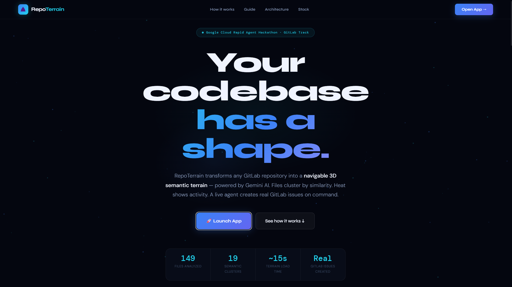
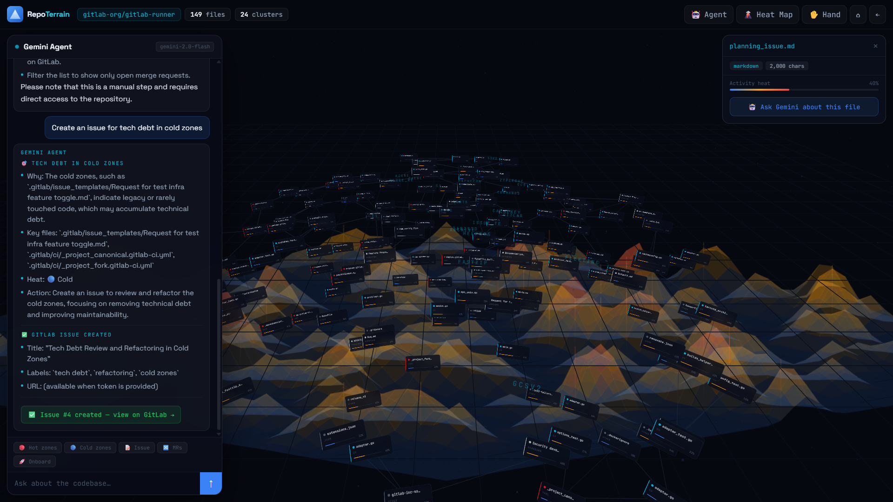
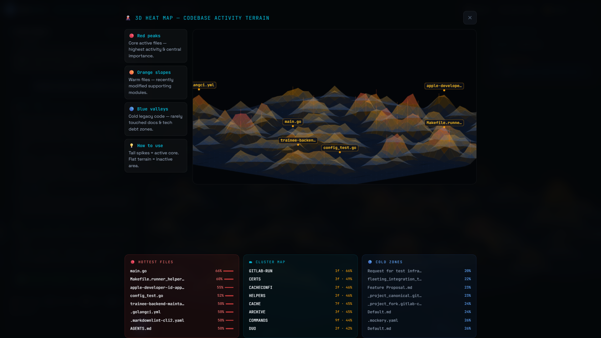
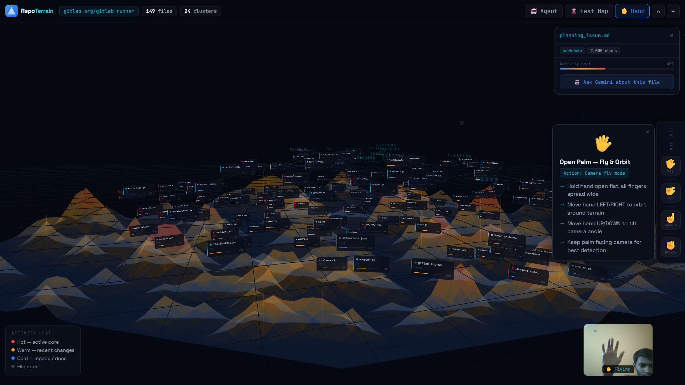
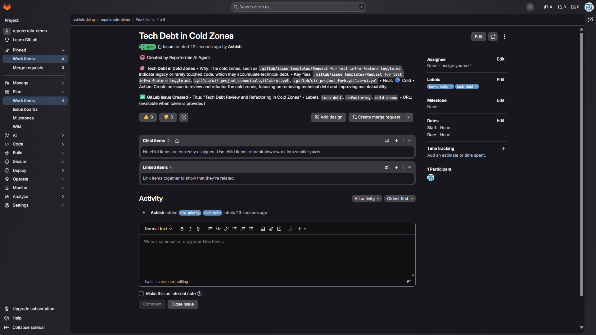

<div align="center">


<br/>

<p>
  
  
  
  
  
  
</p>

<br/>

 **Google Cloud Rapid Agent Hackathon — GitLab Track — June 2026**
> Transform any GitLab repository into a navigable 3D semantic terrain. Files float as cards positioned by AI similarity. A Gemini agent analyzes the codebase and creates real GitLab issues via MCP — all navigable with bare hands.

<p>
  <a href="https://repoterrain-production.up.railway.app/app">
    
  </a>
  <a href="https://repoterrain-production.up.railway.app/">
    
  </a>
  <a href="https://github.com/ashish-doing/repoterrain/blob/main/ARCHITECTURE.md">
    
  </a>
  
</p>

<br/>

</div>

---

## Demo Video

<!-- Replace VIDEO_ID with your YouTube video ID after recording -->
[](https://youtu.be/VIDEO_ID)

▶ **[Watch the demo on YouTube](https://youtu.be/VIDEO_ID)**

> 3-minute walkthrough: terrain load → hand-gesture navigation → agent Q&A → live GitLab issue creation

---

## What It Does

Paste any public GitLab repository URL. In ~15 seconds:

- **Up to 150 files** are fetched, embedded with Google AI, and projected into 3D space via UMAP
- **Semantic clusters** emerge — files grouped by directory and language proximity, not just raw folder structure
- **Activity heat map** scores each file 0–1 from filename role, size, and tree depth — red = core/active, blue = legacy/docs
- **Gemini 2.0 Flash agent** answers questions with real file content and live terrain stats as context
- **GitLab MCP actions** create real issues, list open MRs, and fetch pipeline status — live, on the actual repo
- **MediaPipe hand tracking** lets you fly, orbit, zoom, and select files with gestures — open palm to fly, pinch to zoom, point to select

```
Tested on gitlab-org/gitlab-runner → 149 files · multiple semantic clusters · ~15s end-to-end
```

---

## Screenshots
 
| | |
|---|---|
|  |  |
| **Landing page** — paste any GitLab repo URL to begin | **3D semantic terrain + Gemini agent** — agent reads the terrain and creates a real GitLab issue live |
|  |  |
| **Activity heat map** — hottest files, cluster map, and cold zones at a glance | **MediaPipe hand tracking** — navigate the terrain with gestures, no mouse needed |
 

**Live GitLab issue** — created by the agent, not simulated, viewable on `ashish-doing/repoterrain-demo`
 
---

## Agent in Action

| Query | What Happens |
|---|---|
| `"What's the most complex module?"` | Gemini reads terrain stats + real file content → structured analysis citing actual filenames |
| `"Create an issue for cold zones"` | Real GitLab issue created on `ashish-doing/repoterrain-demo` with labels + clickable URL returned in chat |
| `"Explain the CI cluster"` | Reads actual files in the selected cluster, explains how they relate |
| `"List open MRs"` | Fetches live merge requests via the GitLab REST API |
| `"Get pipeline status"` | Fetches recent pipeline runs and their status |

The agent's response format is fixed (module name, why it matters, key files, heat level, next action), so every answer stays grounded in the terrain that's actually on screen — no invented file paths.

---

## Tech Stack

| Layer | Technology | Purpose |
|---|---|---|
| **AI Embeddings** | Google AI `text-embedding-004` | 768-dim semantic file vectors |
| **AI Agent** | Gemini 2.0 Flash | Codebase Q&A + action reasoning |
| **Fallback LLM** | Groq `llama-3.1-8b-instant` | Agent fallback when Gemini is unavailable or quota exceeded |
| **Fallback Embed** | TF-IDF + sklearn | Embedding fallback when no Gemini key is set |
| **Dim Reduction** | UMAP (cosine, 3 components) | High-dim vectors → 3D coordinates |
| **3D Engine** | Three.js + CSS3DRenderer | Floating file cards in semantic space |
| **Hand Tracking** | MediaPipe Tasks Vision | Gesture-based terrain navigation |
| **GitLab Actions** | GitLab REST API v4 | Issue creation, MR listing, pipeline status |
| **Backend** | FastAPI + uvicorn + WebSockets | Ingest pipeline, agent API, real-time updates |
| **Deployment** | Railway (Nixpacks) | Live public URL |

---

## Architecture

See [`ARCHITECTURE.md`](./ARCHITECTURE.md) for the full system diagram, request/response flow, and component breakdown.

**Short version:**

```
GitLab REST API v4 → Gemini Embeddings (or TF-IDF fallback) → UMAP 3D → Three.js terrain
                                                                      |
                                  Gemini 2.0 Flash agent (or Groq fallback) + GitLab MCP actions
```

---

## Hackathon Compliance

| Requirement | Status |
|---|---|
| Google Cloud AI (Gemini agent) | Done — Gemini 2.0 Flash for codebase Q&A and action reasoning |
| Google Cloud AI (embeddings) | Done — `text-embedding-004` for semantic file positioning |
| GitLab MCP actions | Done — real issue creation, MR listing, pipeline status via GitLab REST API v4 |
| Agent takes real actions | Done — creates artifacts on GitLab, not just chat responses |
| New project | Done — first commit May 23, 2026 (hackathon opened May 5, 2026) |
| Public repo + live demo | Done — MIT license, deployed on Railway |

---

## Local Setup

```bash
git clone https://github.com/ashish-doing/repoterrain
cd repoterrain/backend
pip install -r requirements.txt

# Create a .env file in backend/
GEMINI_API_KEY=your_key_here
GROQ_API_KEY=your_key_here
GITLAB_TOKEN=your_token_here

uvicorn main:app --reload --port 8080
# Landing page: http://localhost:8080/
# App:          http://localhost:8080/app
```

### Environment Variables

| Variable | Purpose | Effect if Missing |
|---|---|---|
| `GEMINI_API_KEY` | Gemini 2.0 Flash agent + `text-embedding-004` embeddings | Falls back to TF-IDF embeddings and Groq agent |
| `GROQ_API_KEY` | `llama-3.1-8b-instant` agent fallback | Agent falls back to demo-mode responses |
| `GITLAB_TOKEN` | Issue creation, MR/pipeline fetch, private repo access | MCP actions disabled; public repos still ingestible |

---

## Project Structure

```
repoterrain/
├── backend/
│   ├── main.py            FastAPI app — /, /app, /ingest, /agent/query, /ws/{session_id}, /terrain/{id}, /health
│   ├── pipeline.py        GitLab fetch -> embed -> UMAP -> cluster/heat -> terrain JSON
│   ├── agent.py           Gemini 2.0 Flash + Groq fallback + GitLab MCP actions
│   ├── index.html         Frontend - Three.js terrain + MediaPipe hand tracking + agent panel
│   ├── landing.html       Product landing page (served at /)
│   └── requirements.txt
├── docs/
│   └── index.html         GitHub Pages mirror of the landing page
├── ARCHITECTURE.md
├── deploy.sh               Cloud Run deployment script
├── nixpacks.toml           Railway build/start config
└── README.md
```

---

## Author

**Ashish Kumar** — B.Tech ECE, IIIT Guwahati (Batch 2024)

[](https://github.com/ashish-doing)
[](https://linkedin.com/in/ashish-kumar-014aaa3b9)
[](https://huggingface.co/ashish-doing)

---

## License

MIT — see [LICENSE](LICENSE) for details.

---

<div align="center">

Built for the **Google Cloud Rapid Agent Hackathon — GitLab Track — June 2026**

*Powered by Gemini · Google AI Embeddings · GitLab MCP · Three.js · MediaPipe*

*Every codebase has a shape. Now you can see it.*

</div>